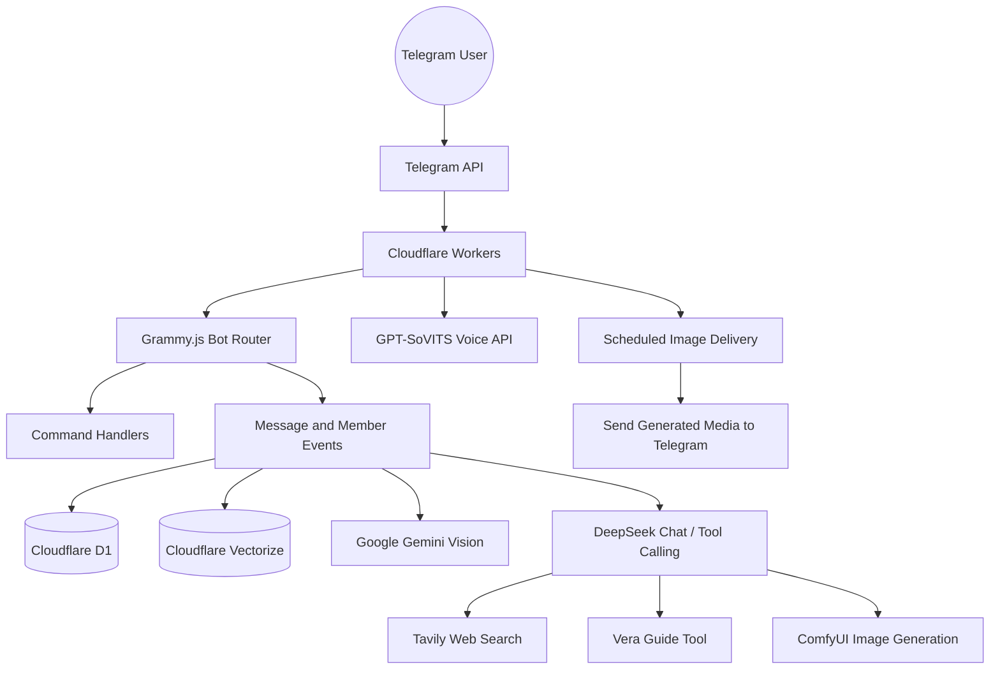
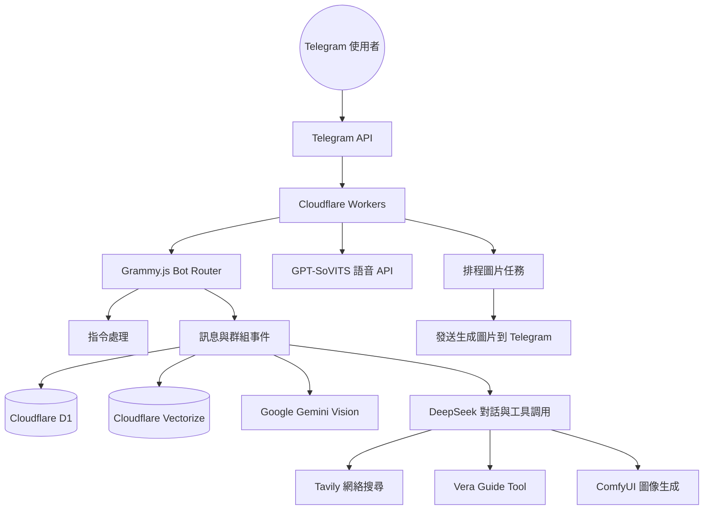

# Vera-bot

[English](#english) | [繁體中文](#繁體中文)

---

## English

Vera-bot is an AI-driven Telegram group agent built on Cloudflare Workers. It combines long-term memory, multimodal understanding, tool calling, image generation, voice synthesis, and group-management commands to create a persistent interactive character for Telegram communities.

The project was designed as both a character bot and an engineering experiment: Vera observes group conversations, remembers user profiles, responds with personality, analyzes images, searches the web when needed, and can trigger external creative tools such as ComfyUI and GPT-SoVITS.

## Screenshots / Demo

Add Telegram screenshots or short demo GIFs here when available.

```text
docs/screenshots/chat-demo.png
docs/screenshots/profile-command.png
docs/screenshots/image-generation.png
```

## Architecture



## Key Features

- **Telegram group agent** powered by Cloudflare Workers and Grammy.js
- **Long-term memory** using Cloudflare D1 for profiles, summaries, logs, room metadata, and user state
- **Vector memory layer** using Cloudflare Vectorize and Workers AI embeddings
- **Multimodal input** through Google Gemini image analysis
- **Reasoning and dialogue** using DeepSeek with tool-calling support
- **Web search tool** through Tavily for real-time information
- **Image generation workflow** connected to ComfyUI
- **Voice reply support** through a GPT-SoVITS-compatible API endpoint
- **Group-management commands** for room names, room descriptions, ordering, logs, memory reset, and emergency controls
- **Scheduled tasks** for polling pending image generation jobs and delivering completed images back to Telegram

## Tech Stack

| Area | Technology |
| :--- | :--- |
| Runtime | Cloudflare Workers |
| Bot Framework | Grammy.js |
| Language | TypeScript |
| SQL Storage | Cloudflare D1 |
| Vector Storage | Cloudflare Vectorize |
| Embeddings | Cloudflare Workers AI |
| Main LLM | DeepSeek API |
| Vision | Google Gemini |
| Search | Tavily API |
| Image Generation | ComfyUI |
| Voice | GPT-SoVITS-compatible API |
| Testing | Vitest |
| Deployment | Wrangler |

## Project Structure

```text
Vera-bot/
+-- src/commands/        # Telegram slash commands
+-- src/core/            # Worker entrypoint and bot registration
+-- src/db/              # Memory/database helpers
+-- src/events/          # Message, callback, member, and topic handlers
+-- src/middlewares/     # Auth and auto-delete middleware
+-- src/services/        # DeepSeek, Gemini, ComfyUI, and voice services
+-- src/shared/          # Prompts, constants, types, guide, and utilities
+-- schema.sql           # Main D1 schema
+-- migrate_*.sql        # Incremental D1 migrations
+-- wrangler.jsonc       # Cloudflare Worker configuration
+```

## Commands

| Command | Purpose | Access |
| :--- | :--- | :--- |
| `/start` | Basic bot entry message | User |
| `/vera` | Show Vera's guide/help message | User |
| `/profile` | View personal memory/profile summary | User |
| `/fortune` | Generate a daily fortune-style reply | User |
| `/gi` or `/group_impression` | Generate a group impression report | User |
| `/cg` | View unlocked/generated CG records | User |
| `/deletecg` | Delete CG records | Admin |
| `/setroomname` | Set a room/topic display name | Admin |
| `/setroomdesc` | Set a room/topic description | Admin |
| `/setroomorder` | Set room/topic display order | Admin |
| `/purge_all_memory` | Reset stored memory | Admin |
| `/emergency` | Emergency control command | Admin |

## Quick Start

### 1. Install dependencies

```bash
npm install
```

### 2. Configure local environment

Create a `.dev.vars` file for local development. Do not commit real secrets.

```env
BOT_TOKEN=your_telegram_bot_token
DEEPSEEK_API_KEY=your_deepseek_key
GEMINI_API_KEY=your_gemini_key
TAVILY_API_KEY=your_tavily_key
VOICE_API_URL=optional_voice_api_endpoint
```

### 3. Create / migrate D1 database

```bash
npx wrangler d1 execute vera-db --remote --file=schema.sql
npx wrangler d1 execute vera-db --remote --file=migrate_rooms.sql
npx wrangler d1 execute vera-db --remote --file=migrate_phase1.sql
npx wrangler d1 execute vera-db --remote --file=migrate_phase2.sql
npx wrangler d1 execute vera-db --remote --file=migrate_welcome_logs.sql
```

Run only the migrations that match the current database state.

### 4. Run locally

```bash
npm run dev
```

### 5. Deploy

```bash
npm run deploy
```

## Security Notes

- `.dev.vars`, `.env`, `.wrangler/`, and `node_modules/` should never be committed.
- Keep API keys in Cloudflare secrets or local environment files.
- Review any hardcoded third-party endpoints before making the repository public.
- If the bot is used in real Telegram groups, review memory retention and admin-only commands carefully.

## Roadmap

- Move all external service endpoints into environment variables
- Add screenshots and short demo GIFs
- Add clearer setup scripts for D1 migrations
- Add tests for command handlers and memory logic
- Improve admin documentation for production-like deployment
- Add privacy controls for memory deletion and data export

---

## 繁體中文

Vera-bot 是一個部署在 Cloudflare Workers 上的 AI Telegram 群組智能代理。它結合長期記憶、多模態理解、工具調用、圖像生成、語音生成及群組管理指令，目標是在 Telegram 群組入面建立一個有持續記憶和角色性格的互動式 AI 角色。

這個專案既是角色 bot，也是一次工程實驗：Vera 會觀察群組對話、記住使用者資料、以固定人格回應、分析圖片、需要時搜尋網絡資料，並能連接 ComfyUI、GPT-SoVITS 等外部創作工具。

## 截圖 / Demo

之後可以加入 Telegram 對話截圖或短 GIF：

```text
docs/screenshots/chat-demo.png
docs/screenshots/profile-command.png
docs/screenshots/image-generation.png
```

## 系統架構



## 主要功能

- **Telegram 群組智能代理**：以 Cloudflare Workers 和 Grammy.js 建立 webhook bot
- **長期記憶**：使用 Cloudflare D1 儲存使用者 profile、對話摘要、房間資料及狀態
- **向量記憶層**：使用 Cloudflare Vectorize 及 Workers AI embeddings
- **多模態理解**：使用 Google Gemini 分析圖片內容
- **推理與對話**：使用 DeepSeek，並支援 tool calling
- **網絡搜尋工具**：透過 Tavily 搜尋即時資訊
- **圖像生成流程**：連接 ComfyUI 生成角色圖片/CG
- **語音回覆**：支援 GPT-SoVITS 相容 API endpoint
- **群組管理指令**：支援房間名稱、介紹、排序、logs、記憶重置及 emergency control
- **排程任務**：定時檢查 pending image jobs，完成後發送回 Telegram

## 技術棧

| 範疇 | 技術 |
| :--- | :--- |
| Runtime | Cloudflare Workers |
| Bot Framework | Grammy.js |
| 語言 | TypeScript |
| SQL Storage | Cloudflare D1 |
| Vector Storage | Cloudflare Vectorize |
| Embeddings | Cloudflare Workers AI |
| Main LLM | DeepSeek API |
| Vision | Google Gemini |
| Search | Tavily API |
| Image Generation | ComfyUI |
| Voice | GPT-SoVITS-compatible API |
| Testing | Vitest |
| Deployment | Wrangler |

## 專案結構

```text
Vera-bot/
+-- src/commands/        # Telegram slash commands
+-- src/core/            # Worker entrypoint and bot registration
+-- src/db/              # Memory/database helpers
+-- src/events/          # Message, callback, member, and topic handlers
+-- src/middlewares/     # Auth and auto-delete middleware
+-- src/services/        # DeepSeek, Gemini, ComfyUI, and voice services
+-- src/shared/          # Prompts, constants, types, guide, and utilities
+-- schema.sql           # Main D1 schema
+-- migrate_*.sql        # Incremental D1 migrations
+-- wrangler.jsonc       # Cloudflare Worker configuration
+```

## 指令列表

| 指令 | 用途 | 權限 |
| :--- | :--- | :--- |
| `/start` | 基本啟動訊息 | User |
| `/vera` | 顯示 Vera 使用指南 | User |
| `/profile` | 查看個人記憶/profile 摘要 | User |
| `/fortune` | 生成每日 fortune 回覆 | User |
| `/gi` 或 `/group_impression` | 生成群組觀察報告 | User |
| `/cg` | 查看已解鎖/生成的 CG 紀錄 | User |
| `/deletecg` | 刪除 CG 紀錄 | Admin |
| `/setroomname` | 設定房間/topic 顯示名稱 | Admin |
| `/setroomdesc` | 設定房間/topic 介紹 | Admin |
| `/setroomorder` | 設定房間/topic 排序 | Admin |
| `/purge_all_memory` | 重置記憶資料 | Admin |
| `/emergency` | 緊急控制指令 | Admin |

## 快速開始

### 1. 安裝依賴

```bash
npm install
```

### 2. 設定本地環境變數

建立 `.dev.vars` 作本地開發用途。不要 commit 真實 secrets。

```env
BOT_TOKEN=your_telegram_bot_token
DEEPSEEK_API_KEY=your_deepseek_key
GEMINI_API_KEY=your_gemini_key
TAVILY_API_KEY=your_tavily_key
VOICE_API_URL=optional_voice_api_endpoint
```

### 3. 建立 / 遷移 D1 資料庫

```bash
npx wrangler d1 execute vera-db --remote --file=schema.sql
npx wrangler d1 execute vera-db --remote --file=migrate_rooms.sql
npx wrangler d1 execute vera-db --remote --file=migrate_phase1.sql
npx wrangler d1 execute vera-db --remote --file=migrate_phase2.sql
npx wrangler d1 execute vera-db --remote --file=migrate_welcome_logs.sql
```

只需要執行符合目前資料庫狀態的 migration。

### 4. 本地運行

```bash
npm run dev
```

### 5. 部署

```bash
npm run deploy
```

## 安全注意事項

- `.dev.vars`、`.env`、`.wrangler/`、`node_modules/` 不應 commit
- API keys 應放在 Cloudflare secrets 或本地環境檔
- 如果 repo 要公開，請先檢查有沒有 hardcoded 第三方 endpoint
- 如果 bot 用於真實 Telegram 群組，請謹慎處理記憶保存、刪除及 admin-only 指令

## 未來改進方向

- 將所有外部服務 endpoint 移到環境變數
- 加入 Telegram 對話截圖或 demo GIF
- 整理 D1 migration setup scripts
- 為 command handlers 和 memory logic 加測試
- 補充 production-like deployment admin guide
- 加入記憶刪除及資料匯出等 privacy controls

---

> Vera is observing the room. Keep the data interesting.
