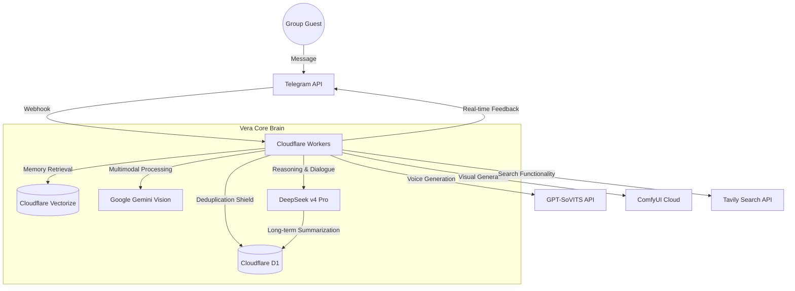
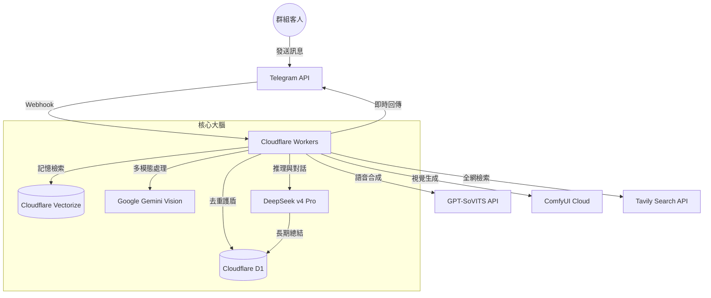

# 🔮 Vera-bot (薇拉)

[](#-english-version) [](#-繁體中文版本)

---

## 🇺🇸 English Version

Vera-bot is an advanced, AI-driven Telegram group guide and interactive agent inspired by the character **Herta** from *Honkai: Star Rail*. Running on the bleeding edge of the Cloudflare ecosystem, Vera combines deep logical reasoning with long-term memory to provide a unique "simulated social observation" experience.

### ✨ Overview
Vera isn't just another chatbot. She is a **Simulated Social Experiment Overseer**. Designed with a cool, detached, and brilliant persona, she monitors group dynamics, interacts with "guests" (users), and maintains a persistent memory of every interaction. 

### 🏗️ System Architecture



### 🌟 Core Features
- **Advanced Contextual Intelligence**: Understands triadic conversations and includes a custom D1-based deduplication shield.
- **Dynamic Memory & Archiving**: Dual-tier memory system (Internal logs + Concise Chinese summaries) and dynamic behavioral tags.
- **Intelligent Group Management**: Topic-aware automated welcome system and periodic observation reports.
- **Memory-Based Relationships**: Vera's attitude evolves naturally based on past interaction history.

### 🛠️ Detailed Tech Stack

| Category | Technology | Role |
| :--- | :--- | :--- |
| **Compute** | [Cloudflare Workers](https://workers.cloudflare.com/) | Edge runtime for global, low-latency execution |
| **Primary AI** | [DeepSeek v4 Pro](https://deepseek.com/) | Logic, reasoning, and core dialogue generation |
| **Vision AI** | [Google Gemini 1.5 Pro](https://deepmind.google/technologies/gemini/) | Multimodal understanding of images and stickers |
| **Vector DB** | [Cloudflare Vectorize](https://developers.cloudflare.com/vectorize/) | Vector storage for Long-term Memory (RAG) |
| **Embedding** | [Cloudflare AI Workers](https://developers.cloudflare.com/workers-ai/) | `@cf/baai/bge-m3` model for vector generation |
| **SQL DB** | [Cloudflare D1](https://developers.cloudflare.com/d1/) | Distributed SQL for user profiles and state management |
| **Bot Framework** | [Grammy.js](https://grammy.dev/) | High-performance Telegram Bot framework |
| **Search Engine** | [Tavily API](https://tavily.com/) | AI-optimized web search for real-time information |
| **Image Gen** | [ComfyUI Cloud](https://comfyanonymous.github.io/ComfyUI/) | Remote generation of "holographic visual data shards" |
| **Voice Synth** | [GPT-SoVITS](https://github.com/RVC-Boss/GPT-SoVITS) | Dynamic voice generation and response synthesis |
| **Development** | [TypeScript](https://www.typescriptlang.org/) | Type-safe development for complex AI logic |

---

## 🇭🇰 繁體中文版本

薇拉 (Vera-bot) 是一款受《崩壞：星穹鐵道》中「**黑塔**」啟發而設計的進階 AI Telegram 群組引導機器人。基於 Cloudflare 生態系的尖端技術，薇拉結合了深層邏輯推理與長期記憶系統，為群組提供獨特的「模擬社交觀測」體驗。

### ✨ 概覽
薇拉不只是一個普通的聊天機器人。她是「**模擬社交實驗的觀測者**」。她擁有冷靜、疏離且天才的人設，負責監控群組動態、與「客人」（用戶）互動，並對每一次交流保持持久的記憶。

### 🏗️ 系統架構



### 🌟 核心功能
- **進階上下文智能**: 具備「三人對話理解」能力，並內建 D1 去重護盾，徹底解決重複回覆問題。
- **動態記憶與歸檔**: 雙軌制記憶系統（內部詳細日誌 + 對外精簡摘要），自動賦予客人動態行為標籤。
- **智能群組管理**: 子頻道感知的全自動引導系統，以及定期的「群組觀察報告」。
- **動態關係評估**: 薇拉的態度不再是簡單的分數，而是根據歷史記憶產生的智力尊重或冷淡。

### 🛠️ 詳細技術棧

| 類別 | 技術組件 | 角色 |
| :--- | :--- | :--- |
| **運算節點** | [Cloudflare Workers](https://workers.cloudflare.com/) | 邊緣執行環境，實現全球低延遲響應 |
| **核心大腦** | [DeepSeek v4 Pro](https://deepseek.com/) | 負責高難度邏輯推理與核心對話演繹 |
| **視覺系統** | [Google Gemini 1.5 Pro](https://deepmind.google/technologies/gemini/) | 讓薇拉具備理解圖片與貼圖的多模態能力 |
| **向量記憶** | [Cloudflare Vectorize](https://developers.cloudflare.com/vectorize/) | 儲存長期記憶（RAG），實現長久相處感 |
| **特徵向量** | [Cloudflare AI Workers](https://developers.cloudflare.com/workers-ai/) | 使用 `@cf/baai/bge-m3` 模型進行向量編碼 |
| **資料儲存** | [Cloudflare D1](https://developers.cloudflare.com/d1/) | 分佈式 SQL 資料庫，管理用戶屬性與狀態 |
| **開發框架** | [Grammy.js](https://grammy.dev/) | 極速且強大的 Telegram Bot 框架 |
| **搜尋引擎** | [Tavily API](https://tavily.com/) | AI 專用的實時全網數據檢索系統 |
| **視覺生成** | [ComfyUI Cloud](https://comfyanonymous.github.io/ComfyUI/) | 遠程觸發 ComfyUI 節點生成高清自拍圖 |
| **語音合成** | [GPT-SoVITS](https://github.com/RVC-Boss/GPT-SoVITS) | 動態語音合成，賦予薇拉真實的聲音 |
| **工程開發** | [TypeScript](https://www.typescriptlang.org/) | 使用強型別語言確保 AI 邏輯的嚴密性 |

---

## 🛠️ Command Reference | 指令手冊

| 指令 (Command) | 說明 (Description) | 權限 (Auth) |
| :--- | :--- | :--- |
| `/profile` | 檢視觀測日誌與標籤 (View observation log & tags) | 客人 (Guests) |
| `/fortune` | 今日概率運算 (Daily Fortune) | 客人 (Guests) |
| `/gi` | 群組觀察報告 (Group Impression Report) | 客人 (Guests) |
| `/purge_all_memory` | 終極重置系統 (Total Reset) | 創作者 (Admin) |
| `/setroomdesc` | 設定房間介紹 (Set room description) | 創作者 (Admin) |
| `/setroomorder` | 調整房間排序 (Set room sort order) | 創作者 (Admin) |

---

## 🚀 Quick Start | 快速開始

1. **Environment (環境)**: Copy `.dev.vars.example` to `.dev.vars` and fill in API keys.
2. **Database (資料庫)**: 
   ```bash
   npx wrangler d1 execute vera-db --remote --file=schema.sql
   npx wrangler d1 execute vera-db --remote --file=migrate_rooms.sql
   ```
3. **Deploy (部署)**: `npm run deploy`.

---

> *"Vera is observing your every move. Ensure your data remains interesting. vera~"*
