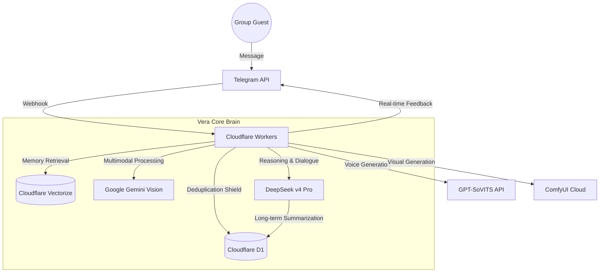

# 🔮 Vera-bot (薇拉)

Vera-bot is an advanced, AI-driven Telegram group guide and interactive agent inspired by the character **Herta** from *Honkai: Star Rail*. Running on the bleeding edge of the Cloudflare ecosystem, Vera combines deep logical reasoning with long-term memory to provide a unique "simulated social observation" experience.

[View Architecture](#-system-architecture) • [Core Features](#-core-features) • [Quick Start](#-quick-start) • [Command Reference](#-command-reference)

---

## ✨ Overview

Vera isn't just another chatbot. She is a **Simulated Social Experiment Overseer**. Designed with a cool, detached, and brilliant persona, she monitors group dynamics, interacts with "guests" (users), and maintains a persistent memory of every interaction. 

### Why Vera?
- **High Intelligence**: Driven by DeepSeek v4 Pro, capable of complex reasoning and dry wit.
- **Robust Engineering**: Built to handle high-traffic groups with zero duplicate replies and 100% webhook reliability.
- **Persistent Persona**: Maintains a strict "Herta-like" character across sessions, evolving based on her memory of you.

---

## 🏗️ System Architecture

Vera is built for performance and global scale using a serverless approach:



---

## 🌟 Core Features

### 🧠 Advanced Contextual Intelligence
- **Triadic Dialogue Understanding**: Vera understands three-way conversations (User A replying to User B while mentioning Vera), allowing for precise "eavesdropping" and witty intervention.
- **Deduplication Shield**: Custom D1-based middleware ensures that every Telegram update is processed exactly once, even during AI latency timeouts.

### 📂 Dynamic Memory & Archiving
- **Dual-Tier Memory**: Vera maintains a detailed internal clinical log (English) for reasoning and a concise observation summary (Chinese) for the user's profile.
- **Dynamic Titles**: Automatically assigns behavioral tags like `Night Owl` or `Logic Disrupter` based on your conversation patterns.
- **Memory-Based Relationships**: No simple "points." Vera’s attitude (from cool indifference to intellectual respect) is determined by her past experiences with you.

### 🗺️ Intelligent Group Management
- **Topic-Aware Welcome**: Automatically greets new guests directly in specific rooms (e.g., Thread 210) with interactive navigation portals.
- **Automated Summaries**: Generates periodic "Group Observation Reports" analyzing the recent atmosphere and member activity.
- **Room Management**: Dynamic command set to describe, order, or hide various sub-channels (topics) in the group.

---

## 🛠️ Tech Stack

- **Runtime**: [Cloudflare Workers](https://workers.cloudflare.com/) (Edge Runtime)
- **AI/LLM**: DeepSeek v4 Pro (Core), Gemini 1.5 Pro (Vision)
- **Database**: [Cloudflare D1](https://developers.cloudflare.com/d1/) (Distributed SQL)
- **Vector DB**: [Cloudflare Vectorize](https://developers.cloudflare.com/vectorize/) (RAG Memory)
- **Framework**: [Grammy.js](https://grammy.dev/)
- **Media**: ComfyUI (Image), GPT-SoVITS (Voice)

---

## 🛠️ Command Reference

### For Guests
- `/profile` - View your observation log, dynamic titles, and relationship status.
- `/fortune` - Run a high-dimensional probability calculation (Daily Fortune).
- `/gi` or `/group_impression` - Request a summary report of the current group dynamics.
- `/cg` - (PM only) Access your unlocked visual data shards (Gallery).

### For Creators (Admin/Boss)
- `/purge_all_memory` - **[Total Reset]** Wipe all messages, vector memories, and user profiles.
- `/setroomdesc <text>` - Configure room descriptions for the automated welcome system.
- `/setroomorder <num>` - Adjust the priority of rooms in the navigation list.
- `/temp <val>` - Calibrate AI creativity (Temperature).
- `/checklogs` - View recent system diagnostic logs.

---

## 🚀 Quick Start

1. **Environment**: Copy `.dev.vars.example` to `.dev.vars` and fill in your API keys.
2. **Database**: 
   ```bash
   npx wrangler d1 execute vera-db --remote --file=schema.sql
   npx wrangler d1 execute vera-db --remote --file=migrate_rooms.sql
   ```
3. **Memory Index**: Create a Vectorize index named `ciallo-memory-index` (1024 dims).
4. **Deploy**:
   ```bash
   npm run deploy
   ```

---

## 🗺️ Roadmap

- [ ] **Autonomous Auto-Mod**: AI-driven filtering of "Low-frequency" spam data.
- [ ] **Scheduled Log Exports**: Daily EOD reports automatically posted to the main hall.
- [ ] **Simulated Universe Games**: Logic-based mini-games integrated with `/coin`.

---

> *"Vera is observing your every move. Ensure your data remains interesting. vera~"*
