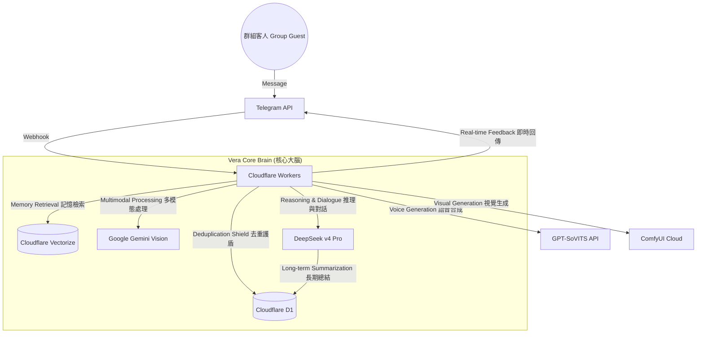

# 🔮 Vera-bot (薇拉)

Vera-bot is an advanced, AI-driven Telegram group guide and interactive agent inspired by the character **Herta** from *Honkai: Star Rail*. Running on the bleeding edge of the Cloudflare ecosystem, Vera combines deep logical reasoning with long-term memory to provide a unique "simulated social observation" experience.

薇拉 (Vera-bot) 是一款受《崩壞：星穹鐵道》中「**黑塔**」啟發而設計的進階 AI Telegram 群組引導機器人。基於 Cloudflare 生態系的尖端技術，薇拉結合了深層邏輯推理與長期記憶系統，為群組提供獨特的「模擬社交觀測」體驗。

[View Architecture](#-system-architecture) • [Core Features](#-core-features) • [Quick Start](#-quick-start) • [Command Reference](#-command-reference)

---

## ✨ Overview | 概覽

Vera isn't just another chatbot. She is a **Simulated Social Experiment Overseer**. Designed with a cool, detached, and brilliant persona, she monitors group dynamics, interacts with "guests" (users), and maintains a persistent memory of every interaction. 

薇拉不只是一個普通的聊天機器人。她是「**模擬社交實驗的觀測者**」。她擁有冷靜、疏離且天才的人設，負責監控群組動態、與「客人」（用戶）互動，並對每一次交流保持持久的記憶。

### Why Vera? | 為什麼選擇薇拉？
- **High Intelligence (高智能)**: Driven by DeepSeek v4 Pro, capable of complex reasoning and dry wit. | 由 DeepSeek v4 Pro 驅動，具備複雜的邏輯推理能力與乾冷的幽默感。
- **Robust Engineering (穩定工程)**: Built to handle high-traffic groups with zero duplicate replies and 100% webhook reliability. | 專為高流量群組設計，具備零重複回覆機制與 100% 的 Webhook 穩定性。
- **Persistent Persona (持久人設)**: Maintains a strict "Herta-like" character across sessions, evolving based on her memory of you. | 在不同會話中保持嚴謹的「黑塔式」人設，並根據對妳的記憶而不斷進化。

---

## 🏗️ System Architecture | 系統架構

Vera is built for performance and global scale using a serverless approach:
薇拉採用無伺服器架構，旨在實現高性能與全球規模的擴展：



---

## 🌟 Core Features | 核心功能

### 🧠 Advanced Contextual Intelligence | 進階上下文智能
- **Triadic Dialogue Understanding (三人對話理解)**: Vera understands three-way conversations (User A replying to User B while mentioning Vera). | 薇拉能理解三方對話（客人 A 回覆客人 B 時提及薇拉），實現精準的「插嘴」與幽默介入。
- **Deduplication Shield (去重護盾)**: Custom D1-based middleware ensures that every Telegram update is processed exactly once. | 基於 D1 的自定義中間件，確保即使在 AI 延遲超時的情況下，每條訊息也僅被處理一次。

### 📂 Dynamic Memory & Archiving | 動態記憶與歸檔
- **Dual-Tier Memory (雙軌制記憶)**: Detailed internal clinical logs (English) for reasoning and concise observation summaries (Chinese) for users. | 為推理保留詳細的內部臨床日誌（英文），並為客人面板提供精簡的觀測摘要（中文）。
- **Dynamic Titles (動態稱號)**: Automatically assigns behavioral tags like `Night Owl` based on conversation patterns. | 根據妳的對話模式自動賦予行為標籤，如 `深夜話癆` 或 `邏輯干擾源`。
- **Memory-Based Relationships (基於記憶的關係)**: Vera’s attitude is determined by her past experiences with you, not just simple points. | 薇拉的態度（從冷淡不屑到智力尊重）是由她與妳的過往交流品質決定的，而非生硬的分數。

### 🗺️ Intelligent Group Management | 智能群組管理
- **Topic-Aware Welcome (子頻道感知引導)**: Automatically greets new guests directly in specific rooms (e.g., Thread 210) with navigation portals. | 在新人加入時，自動在指定房間（如休閒區 ID 210）發送標記標記與一鍵跳轉導航。
- **Automated Summaries (自動化總結)**: Generates periodic "Group Observation Reports" analyzing recent member activity. | 定期生成「群組觀察報告」，分析最近的成員活躍度與對話氛圍。

---

## 🛠️ Tech Stack | 技術棧

- **Runtime**: [Cloudflare Workers](https://workers.cloudflare.com/) (Edge Runtime)
- **AI/LLM**: DeepSeek v4 Pro (Core 大腦), Gemini 1.5 Pro (Vision 視覺)
- **Database**: [Cloudflare D1](https://developers.cloudflare.com/d1/) (Distributed SQL 分佈式資料庫)
- **Vector DB**: [Cloudflare Vectorize](https://developers.cloudflare.com/vectorize/) (RAG Memory 向量記憶)
- **Framework**: [Grammy.js](https://grammy.dev/)
- **Media**: ComfyUI (Image 圖像), GPT-SoVITS (Voice 語音)

---

## 🛠️ Command Reference | 指令手冊

### For Guests | 客人專用
- `/profile` - View your observation log, dynamic titles, and relationship status. | 檢視妳的觀測日誌、動態稱號與關係狀態。
- `/fortune` - Run a high-dimensional probability calculation (Daily Fortune). | 進行一次高維度概率運算（今日占卜）。
- `/gi` or `/group_impression` - Request a summary report of current group dynamics. | 請求一份當前群組動態的摘要報告。
- `/cg` - (PM only) Access your unlocked visual data shards (Gallery). | (僅限私訊) 開啟已解鎖的視覺數據碎片（圖鑑）。

### For Creators | 創作者專用 (Admin/Boss)
- `/purge_all_memory` - **[Total Reset]** Wipe all messages, vector memories, and user profiles. | **【終極重置】** 抹除所有對話紀錄、向量記憶與用戶檔案。
- `/setroomdesc <text>` - Configure room descriptions for the automated welcome system. | 為自動引導系統設定房間介紹。
- `/setroomorder <num>` - Adjust the priority of rooms in the navigation list. | 調整房間在導航列表中的優先順序。
- `/temp <val>` - Calibrate AI creativity (Temperature). | 校準 AI 創造力（溫度）。
- `/checklogs` - View recent system diagnostic logs. | 檢視最近的系統診斷日誌。

---

## 🚀 Quick Start | 快速開始

1. **Environment (環境)**: Copy `.dev.vars.example` to `.dev.vars` and fill in API keys. | 填寫 `.dev.vars` 中的 API 密鑰。
2. **Database (資料庫)**: 
   ```bash
   npx wrangler d1 execute vera-db --remote --file=schema.sql
   npx wrangler d1 execute vera-db --remote --file=migrate_rooms.sql
   ```
3. **Memory Index (記憶索引)**: Create a Vectorize index named `ciallo-memory-index` (1024 dims). | 建立名為 `ciallo-memory-index` 的向量索引。
4. **Deploy (部署)**: `npm run deploy`.

---

## 🗺️ Roadmap | 開發路線圖

- [ ] **Autonomous Auto-Mod**: AI-driven filtering of "Low-frequency" spam data. | AI 驅動的低頻垃圾數據自動過濾。
- [ ] **Scheduled Log Exports**: Daily EOD reports automatically posted to the main hall. | 每日自動在休閒區發布觀測日誌總結。
- [ ] **Simulated Universe Games**: Logic-based mini-games integrated with `/coin`. | 與金幣系統連動的邏輯類小遊戲。

---

> *"Vera is observing your every move. Ensure your data remains interesting. vera~"*
> *"薇拉正在觀測妳的一舉一動。請確保妳提供的數據足夠有趣。vera~"*
