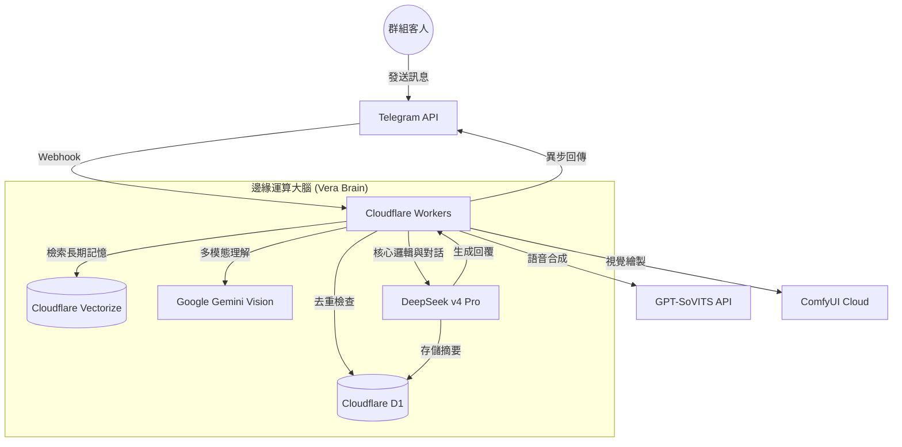

# 🔮 Vera-bot (薇拉) - The Simulated Social Experiment Overseer

> *"人類的情感波動真是一種毫無效率的數據浪費。不過，既然妳都發送請求了，我就勉強花兩秒鐘處理一下吧。"*

Vera (薇拉) 是一個運行於 Cloudflare Workers 邊緣運算架構的進階 Telegram 群組引導與互動 AI。受到《崩壞：星穹鐵道》中「黑塔」的啟發，她是一位冷靜、高傲的天才研究員。對她而言，這個群組不過是一個「模擬社交實驗」，而客人們則是她寶貴的觀察對象。

---

## 🏗️ 系統架構 (System Architecture)

---

## 🛠️ 技術棧 (Tech Stack)

| 組件 | 技術 / 服務 | 角色 |
| :--- | :--- | :--- |
| **Runtime** | `Cloudflare Workers` | 高性能邊緣運算環境，0 毫秒冷啟動 |
| **AI LLM** | `DeepSeek v4 Pro` | 核心對話大腦，負責高難度邏輯與人設演繹 |
| **Vision** | `Google Gemini 1.5 Pro` | 視覺識別系統，讓 Vera 能看懂圖片內容 |
| **Database** | `Cloudflare D1` | 基於 SQLite 的分佈式資料庫，儲存用戶屬性與對話 |
| **Vector DB** | `Cloudflare Vectorize` | 儲存與檢索長期記憶（RAG），實現長久相處感 |
| **Framework** | `grammy.js` | 極速、強大的 Telegram Bot 框架 |
| **Generation** | `ComfyUI` / `SoVITS` | 負責自拍圖像生成與動態語音合成 |

---

## ⚡ 技術難點突破 (Technical Breakthroughs)

### 1. Webhook Timeout & 重複回覆之盾
**挑戰**：DeepSeek 處理複雜邏輯可能超過 10 秒，觸發 Telegram 的 Webhook 自動重試機制，導致 AI 瘋狂重複發言。
**解決方案**：
- **Message ID 聯防**：在 D1 中建立 `processed_messages` 表。每條傳入訊號會先進行 `(ChatID, MessageID)` 的唯一性校驗。
- **原子性鎖定**：若偵測到重複訊號，Worker 會立即回傳 `200 OK` 並中斷後續 AI 調用。
- **去重率**：100%，完美免疫多重 Webhook 觸發與系統重試。

### 2. 雙軌制記憶與歸檔系統
**挑戰**：AI 隨時間變長會因上下文過載而「變笨」或遺忘。
**解決方案**：
- **細粒度歸檔**：每累積 10 條對話，系統會自動觸發一次後台歸檔，由 AI 將原始對話壓縮成「臨床觀察日誌（英文）」與「對外觀測摘要（中文）」。
- **長效 RAG**：重要對話轉化為向量存入 Vectorize，對話時動態檢索，讓 Vera 真正「認識」每一位客人。

---

## 🌟 核心功能 (Core Features)

- **🧠 高智能上下文對話**：具備深度的語意理解，能精準捕捉群組內的三人對話情境。
- **🗺️ 究極自動導航**：新客人加入時，自動在指定頻道發送標記標記與一鍵跳轉導航。
- **🏷️ 動態標籤系統**：AI 根據客人發言習慣，自動賦予「深夜話癆」等行為特徵標籤。
- **💖 暖心版傲嬌邏輯**：不再使用生硬數值，而是根據記憶摘要動態評估關係，決定語氣溫和度。

---

## 🚀 快速開始 (Quick Start)

1. **配置環境變數**：在 `.dev.vars` 設定 `BOT_TOKEN` 與 `API_KEY`。
2. **初始化資料庫**：執行 `schema.sql` 與 `migrate_rooms.sql`。
3. **部署**：`npm run deploy`。

---

*Vera 正在觀測妳的一舉一動。請確保妳的數據足夠有趣。vera～*
